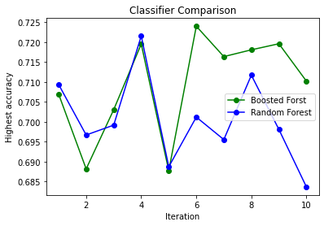
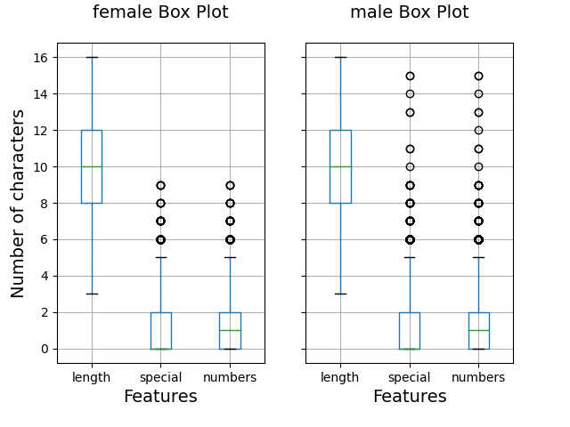

# Gender-Classifier-usernames

## Introduction
This Repository is part of bigger experiment me and my parthner are conducting regarding usernames and gender.  
In this short notebook we will display how to train different classifier from three different datasets using n-grams and utilizing TuriCreate build-in classifiers.  

## Requirements
- The notebook is written in Python 3. A basic knowledge of Python and of the most common Python modules such as `pandas` is required to understand these tutorials.
- This notebook can run in Google Colab. To open a notebook in Google Colab, simply click on the  icon at the top of that notebook. In case you prefer to run the notebooks locally, specific package requirements are indicated at the top of each notebook.

## Datasets
1)	username-gender dictionary 
2)	[Extracted usernames and gender from FXP platform](https://github.com/itsmeboris/FXP-Scrapping)
3)	[Twitter usernames and their gender from Kaggle datasets](https://www.kaggle.com/crowdflower/twitter-user-gender-classification)
4)	[OKCupid usernames and gender dataset](https://github.com/ajaech/username_analytics/tree/master/data/cupid)

## Classifiers
On each dataset we trained 4 different classifiers. We then chose the best classifier (i.e. with the highest test accuracy) and deployed a technique called ensemble learning. Ensemble learning is a method for combining multiple machine learning algorithm to get a better predictive performance. We have used Majority Voting technique. When using majority voting each model makes a prediction for the input, and then we choose the label that has more than half the votes. Since we have 3 datasets for train on, each one is different in nature while still is similar to the others, we chose the best model on each dataset and thus we have 3 different classifier in our ensemble meaning that a majority vote will hold with 2 or 3 votes in favor of the label.
### 7.3.1	Boosted trees + Random forest
We have split our data into train/test sets with a ratio of 80%/20% accordingly.
Then, boosted trees and Random Forest models were trained on them in depth ranging from 10 to 30, to choose the best accuracy model from those depths.
We repeat this experiment 10 times with different random split, to choose the best model by test accuracy.
After training both Random forest and boosted trees, we have compared their performance, as shown below:  

### SVM + Nearest Neighbors (NN)
We trained a SVM and NN on each data. We used TuriCreate SVM and NN built-in models to automatically train each of those models.
### Ensemble implementation
After training each of these classifiers, we chose those who present the highest accuracy on the test sets, as those who participate on our ensemble.
Since we have 3 different data sets, we had 3 models in our ensemble.
To evaluate our ensemble classifier performance, we first examined it on the usernames-gender dataset (80% train and 20% test).
We achieved relatively high accuracy- 83.79% on this dataset, which could be explained by the dataset features, the usernames-gender dataset is extensively based on personal names, which are easy to learn, comparing to complicated usernames.
When the classifier was trained on FXP and Twitter, it achieved 65.28% and 67.75% accuracy on it.
Secondly, we evaluated our ensemble on the OKCupid dataset to test its performance on a new dataset, from different samples population comparing to train.
Here, we achieved an accuracy of 67.67% (FXP, Twitter and user-gender classifiers achieved 69.43%, 63.78% and 68.68%, respectively).
### Deploying Ensemble learning
Given a username, each model makes a prediction, and the ensemble uses majority vote to return the final label.
Since our experiments showed that using n-gram representation provides better accuracy, we extracted n-grams from each username once, then sent the sample with the same features to each model.
Since our classification is “binary” (‘male’, ‘female’), our ensemble is always able to return a majority vote for one of the labels.

## Analysis
Using the [plot.py](plot.py) we can create a female/male boxplot of the information. for example as we can see below in the OKCupid dataset we can see that on average they use the same length, amount of special
characters and numbers in their usernames, but male have outliers in both number and special characters values.  

